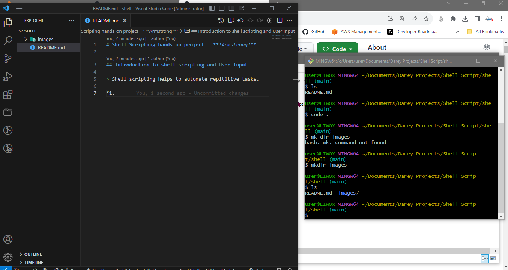
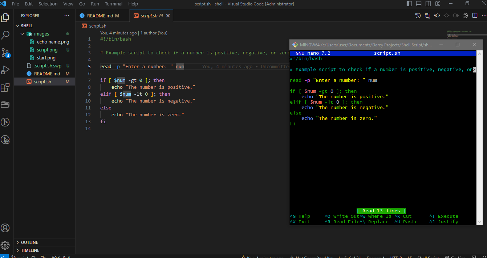

# Shell Scripting hands-on project - ***Armstrong***

## Introduction to shell scripting and User Input

> Shell scripting helps to automate repititive tasks.

> Bash scripts are essentially a series of commands and instructions that are executed sequentially in a shell.



## Create a script file in bash

```
touch script.sh
```

...
## Shell Scripting Syntax Elements

1. Variables

> Bash allows you to define work with variables

> Variables can store date of various kinds

> You can assign values to various variables using the = operator, and access their values using the variable name preceded by a $ sign.

Example : Assign value to *variable*

```
name="Armstrong"
 
```
```
echo $name
```


1. Control Flow

> Bash provides control flow statements like:

if-else 

for loopsand case statements to control the flow of the execution in your scripts.  

Example: Using *if-else* to execute script based on a condition.

```
#!/bin/bash

# Example script to check if a number is positive, negative, or zero

read -p "Enter a number: " num

if [ $num -gt 0 ]; then
    echo "The number is positive."
elif [ $num -lt 0 ]; then
    echo "The number is negative."
else
    echo "The number is zero."
fi
```


```
chmod +x script.sh
```

> run the script

```
./script.sh
```


Example : Iterating through a list using ***a*** for loop

```
#!/bin/bash

# Example script to print numbers from 1 to 5 using a for loop

for (( i=1; i<=5; i++ ))
do
    echo $i
done
```

> run the script

```
./script.sh
```


