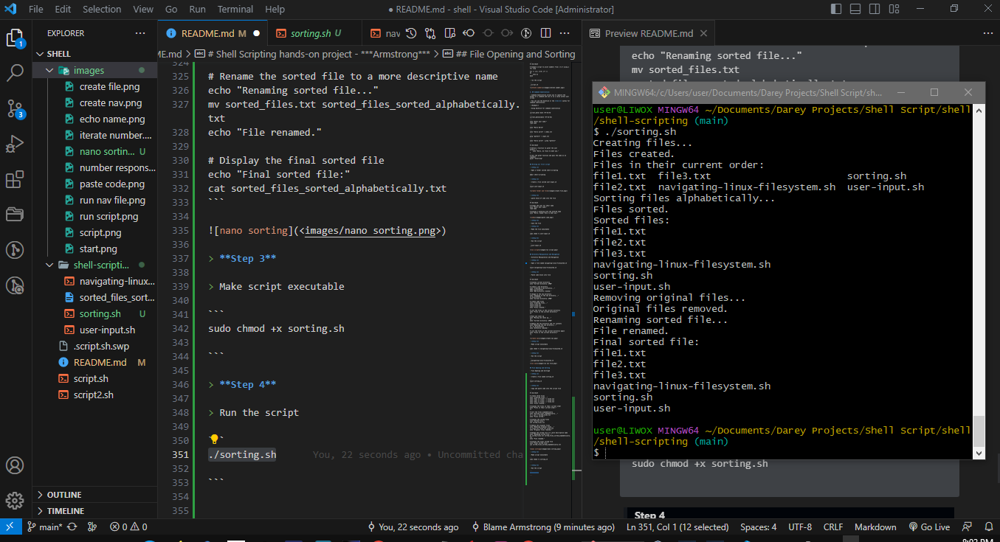

# Shell Scripting hands-on project - ***Armstrong***

## Introduction to shell scripting and User Input

> Shell scripting helps to automate repititive tasks.

> Bash scripts are essentially a series of commands and instructions that are executed sequentially in a shell.


## Create a script file in bash

```
touch script.sh
```

...
## Shell Scripting Syntax Elements

1. ## Variables

> Bash allows you to define work with variables

> Variables can store date of various kinds

> You can assign values to various variables using the = operator, and access their values using the variable name preceded by a $ sign.

Example : Assign value to *variable*

```
name="Armstrong"
 
```
```
echo $name
```


2. ## Control Flow

> Bash provides control flow statements like:

if-else 

for loopsand case statements to control the flow of the execution in your scripts.  

Example: Using *if-else* to execute script based on a condition.

```
#!/bin/bash

# Example script to check if a number is positive, negative, or zero

read -p "Enter a number: " num

if [ $num -gt 0 ]; then
    echo "The number is positive."
elif [ $num -lt 0 ]; then
    echo "The number is negative."
else
    echo "The number is zero."
fi
```


```
chmod +x script.sh
```

> run the script

```
./script.sh
```


Example : Iterating through a list using ***a*** for loop

```
#!/bin/bash

# Example script to print numbers from 1 to 5 using a for loop

for (( i=1; i<=5; i++ ))
do
    echo $i
done
```

> run the script

```
./script.sh
```


3. ## Command Substitution:

> Command Substitution allows you to capture the output of a command and use it as a value within your script.

> You can use the backtick or the ***$()*** syntax for command substitution.

> *Example:* 

> Using backtick for command substitution

```
current_date=`date +%Y-%m-%d`
```
```
current_date=$(date +%Y-%m-%d)
```
```
echo "Enter your name:"
read name
```
```
echo "Hello World"
```
```
echo "hello world" > index.txt
```
```
grep "pattern" < input.txt
```
```
echo "hello world" | grep "pattern"
```
```
#!/bin/bash

# Define a function to greet the user
greet() {
    echo "Hello, $1! Nice to meet you."
}

# Call the greet function and pass the name as an argument
greet "Armstrong"
```


## Writing our first script

> **Step 1** 

> Open a folder called shell-scripting

```
mkdir shell-scripting
```

> **Step 2** 

> Create a file called user-input.sh

```
touch user-input.sh
```


> **Step 3** 

> paste block of code into the file

```
#!/bin/bash

# Prompt the user for their name
echo "Enter your name:"
read name

# Display a greeting with the entered name
echo "Hello, $name! Nice to meet you."
```


> **Step 4** 

> Save the file

> **Step 5** 

> Make the file executable

```
sudo chmod +x user-input.sh
```

> **Step 6** 

> Run the script

```
./user-input.sh
```


## Directory Manipulation and Navigation

> Directory Manipulation and Navigation

> **Step 1** 

> Open a file named navigating-linux-filesystem.sh

```
touch navigating-linux-filesystem.sh
```

> **Step 2** 

> Paste code block into file

```
#!/bin/bash

# Display current directory
echo "Current directory: $PWD"

# Create a new directory
echo "Creating a new directory..."
mkdir my_directory
echo "New directory created."

# Change to the new directory
echo "Changing to the new directory..."
cd my_directory
echo "Current directory: $PWD"

# Create some files
echo "Creating files..."
touch file1.txt
touch file2.txt
echo "Files created."

# List the files in the current directory
echo "Files in the current directory:"
ls

# Move one level up
echo "Moving one level up..."
cd ..
echo "Current directory: $PWD"

# Remove the new directory and its contents
echo "Removing the new directory..."
rm -rf my_directory
echo "Directory removed."

# List the files in the current directory again
echo "Files in the current directory:"
ls
```


> **Step 3** 

> Make script executable

```
sudo chmod +x navigating-linux-filesystem.sh
```

> **Step 4** 

> Run the script

```
./navigating-linux-filesystem.sh
```


## File Opening and Sorting

> File Opening and SortingS

> **Step 1** 

> Create a file named sorting.sh

```
touch sorting.sh
```

> **Step 2** 

> Copy and paste code into the script file

```
#!/bin/bash

# Create three files
echo "Creating files..."
echo "This is file3." > file3.txt
echo "This is file1." > file1.txt
echo "This is file2." > file2.txt
echo "Files created."

# Display the files in their current order
echo "Files in their current order:"
ls

# Sort the files alphabetically
echo "Sorting files alphabetically..."
ls | sort > sorted_files.txt
echo "Files sorted."

# Display the sorted files
echo "Sorted files:"
cat sorted_files.txt

# Remove the original files
echo "Removing original files..."
rm file1.txt file2.txt file3.txt
echo "Original files removed."

# Rename the sorted file to a more descriptive name
echo "Renaming sorted file..."
mv sorted_files.txt sorted_files_sorted_alphabetically.txt
echo "File renamed."

# Display the final sorted file
echo "Final sorted file:"
cat sorted_files_sorted_alphabetically.txt
```


> **Step 3** 

> Make script executable

```
sudo chmod +x sorting.sh

```

> **Step 4** 

> Run the script

```
./sorting.sh

```



## Working with numbers and calculations

> Working with numbers and calculations

> File Opening and SortingS

> **Step 1** 

> Create a file named calculations.sh

```
touch calculations.sh
```

> **Step 2** 

> Copy and paste code into the script file

```
#!/bin/bash

# Define two variables with numeric values
num1=10
num2=5

# Perform basic arithmetic operations
sum=$((num1 + num2))
difference=$((num1 - num2))
product=$((num1 * num2))
quotient=$((num1 / num2))
remainder=$((num1 % num2))

# Display the results
echo "Number 1: $num1"
echo "Number 2: $num2"
echo "Sum: $sum"
echo "Difference: $difference"
echo "Product: $product"
echo "Quotient: $quotient"
echo "Remainder: $remainder"

# Perform some more complex calculations
power_of_2=$((num1 ** 2))
square_root=$(awk "BEGIN{ sqrt=$num2; print sqrt }")

# Display the results
echo "Number 1 raised to the power of 2: $power_of_2"
echo "Square root of number 2: $square_root"
```


> **Step 3** 

> Make script executable

```
sudo chmod +x calculations.sh

```

> **Step 4** 

> Run the script

```
./calculations.sh

```


